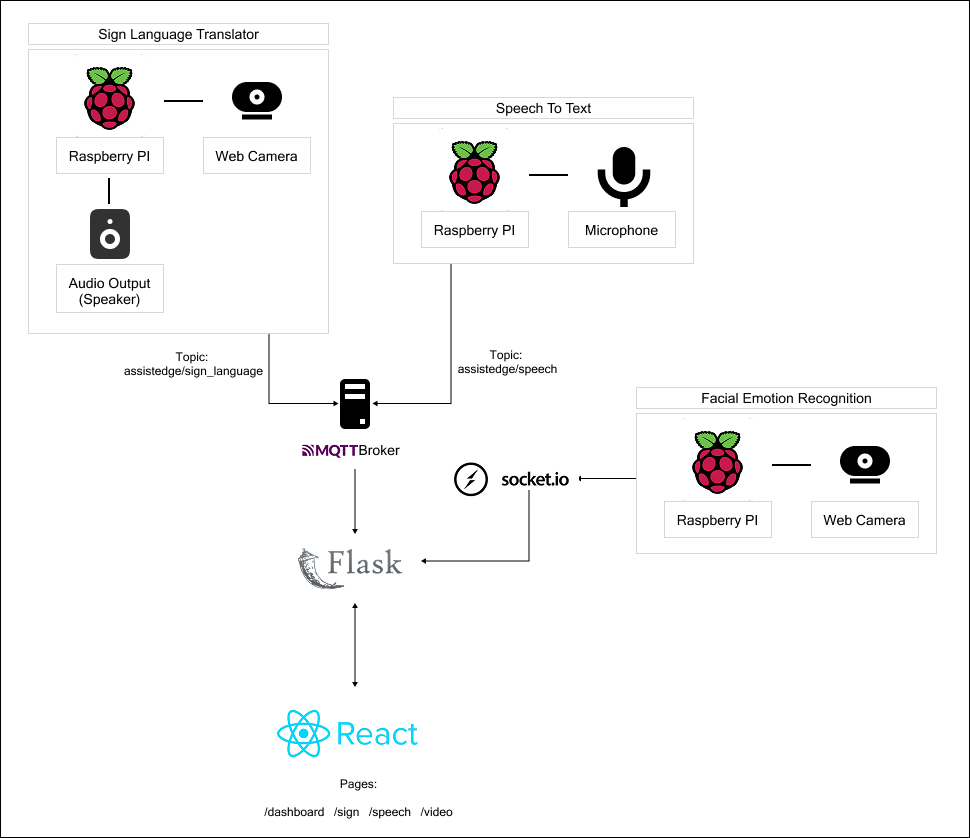

# Introduction & Problem Statement
AssistEdge is an edge computing-based solution designed to bridge communication gaps for individuals who rely on sign language, as well as to improve accessibility for the wider community. By leveraging real-time computer vision and audio processing techniques on affordable hardware, AssistEdge translates sign language gestures into text and concurrently converts spoken language into text and audio output. In addition, the system incorporates facial emotion recognition to display audience emotions, further enhancing interactive communication. 

Every day, individuals who rely on sign language or are visually impaired face significant communication challenges. This technology transforms communication for those who face challenges in environments where spoken language predominates, enhancing interactions by converting between visual, audio, and text modalities.

# Methodology and Proposed Solutions
AssistEdge aims to offer real-time sign language translation, speech-to-text and text-to-speech conversion, and facial emotion recognition.

1. Hardware Setup: Three Raspberry Pi devices are used, each equipped with a webcam for data collection. One of the Raspberry Pi is also connected to a speaker for audio output. A laptop runs the Flask server for processing.

2. Data Transmission: An MQTT broker enables real-time, lightweight messaging between Raspberry Pi devices and the web server, while POST requests are used to send larger data payloads, such as processed video or transcriptions, for storage or further processing.Socket-IO is employed for Facial Emotion Recognition to transfer base64-encoded frame from edge device to Flask backend, and finally retrieved from the React frontend as it is faster than MQTT after comparison.

3. Data Collection and Processing: Each Raspberry Pi manages its own video and audio tasks. The webcams capture video data, while the Raspberry Pi connected to the speaker handles audio output. For Speech To Text, the microphone capture voice data. These devices process their respective data locally.

4. Web Interface: A web interface built using React to display the Sign Language translation, Emotion Recognition results, Speech To Text results in real time. There is also a dashboard detailing the correlation between letters and emotions, and much more insights.

## Architecture Diagram

# Installation
## Prerequisite
- Python version 3.9 - 3.10
- Install Mosquitto Broker on local computer
- Require 3 Raspberry Pi(s)

### 1. Clone the Repository
`https://github.com/aloysiustayy/AssistEdge.git`

### 2. Set Up Virtual Environment
Create and activate a virtual environment in the root folder on Raspberry Pi and local computer:\
`python -m venv .venv`\
`source .venv/bin/activate`   
`# On Windows, use .venv\Scripts\activate`

### 3. Install Dependencies
#### 3.1 On Raspberry Pis
After activating the virtual environment, do the following:\
`cd AssistEdge/SignLanguage`\
`pip install -r requirements.txt`\
`cd ../EmotionDetection`\
`pip install -r requirements.txt`\
`cd ../AudioDetection`\
`pip install -r requirements.txt`

#### 3.2 On Local computer
After activating the virtual environment, do the following:\
`cd AssistEdge/WebMQTT/flask_app`\
`pip install -r requirements.txt`\
`cd ../assistedge-frontend`\
`npm install --legacy-peer-deps`

### 4. Run the everything
#### 4.1 On Raspberry Pi 1 - For Sign Language
a. Start terminal inside the folders: `SignLanguage` and install packages by using the commands:\
`sudo apt-get install epeak-ng`\
`sudo apt install nmap`

b. Run the python script: \
`python infer.py --headless --ip <mqtt_broker_ip_address>`

Parameters:\
`--headless`: Disable GUI display\
`--ip`: MQTT Broker IP address

#### 4.2 On Raspberry Pi 2 and 3
Start another two termnials inside the `AudioDetection` and `EmotionDetection` folders and then:\
`python stt.py` - for AudioDetection\
`python video_streaming.py --headless --check <number> --fps <number> --ip <flask server ip address>` - for EmotionDetection

Parameters:\
`--headless`: Disable GUI display\
`--check`: Run DeepFace analysis every N frames (default: every frame)\
`--fps`: Set the target FPS for stable performance (default: 10)\
`--ip`: Flask Server IP address

#### 4.3 On Local computer
- Start Mosquitto Broker on root directory.\
    `mosquitto -c mosquitto.conf`

- Start two separate terminal inside WebMQTT folder\
        1. Backend (Flask)\
        `cd flask_app`\
        `python api.py`\
        2. Frontend (React)\
        `cd assistedge-frontend`\
        `npm start`

### 5. Results
Go to `http://<localhost-ip>:3000` and view the output

### 6. Experiments (Things the Team tested / tried)
- **Facial Emotion Recognition (FER)**

      Issue: Real-time video streaming of FER with HTTP Post Request was choppy, laggy, with fps averaging around 1~5

      Background: Sending of frames require sending from Edge devices to React Frontend, going through Web Server (Flask)

      Tested / Tried: 
         1. The team shifted to using MQTT and fps increased by a small margin
         2. Looking for improvement, the team used Socket.IO, which further improved FPS by a landslide
         
      Conclusion: Socket.IO is more suitable for real-time video streaming than MQTT and HTTP Post Request which is why the team sticked with Socket.IO

- **Sign Language Translation**

      Issue: Unable to find suitable .tflite or .h5 models online that works plug-and-play

      Background: Looking for .tflite or .h5 models that is able to do inference on edge devices. Some existing models are laggy in terms of infering speed on the edge device, or unable to detect hand signs. Some also did not release the labels that they trained the model with, which made it difficult to use the model.

      Tested / Tried: 
         1. The team tried a few more models from Kaggle, with the same disappointing results
         2. Decided to manually train a model. Looked for datasets online and trained a simple model with Keras Sequential CNN library, managed to achieve relatively accurate sign-to-text translation after testing with learning rate, pixel shape size, number of epoch.
         
      Conclusion: After multiple attempts on trying to use models that are available online, the team decided to use the self-trained model as it is functional, relatively accurate, and runs efficiently on the edge device
      
      
- **Dashboard**

      Issue: Unable to use react-word-cloud library as it depended on a old version of React

      Background: Word Cloud is a good and simple way to efficiently show stakeholders what is the most commonly appeared word, which in our project, is the most commonly detected emotion.

      Tested / Tried: 
         1. Tried to uninstall and install the React version that the library was dependent on, however, to no avail even after clearing out node_modules folder and clear cache
         2. After extensive research, it seems like sticking with the newer React version was possible by including the `--legacy-peer-deps` during `npm install`
         
      Conclusion: React word cloud works on the dashboard page and does not cause conflict with other libraries
